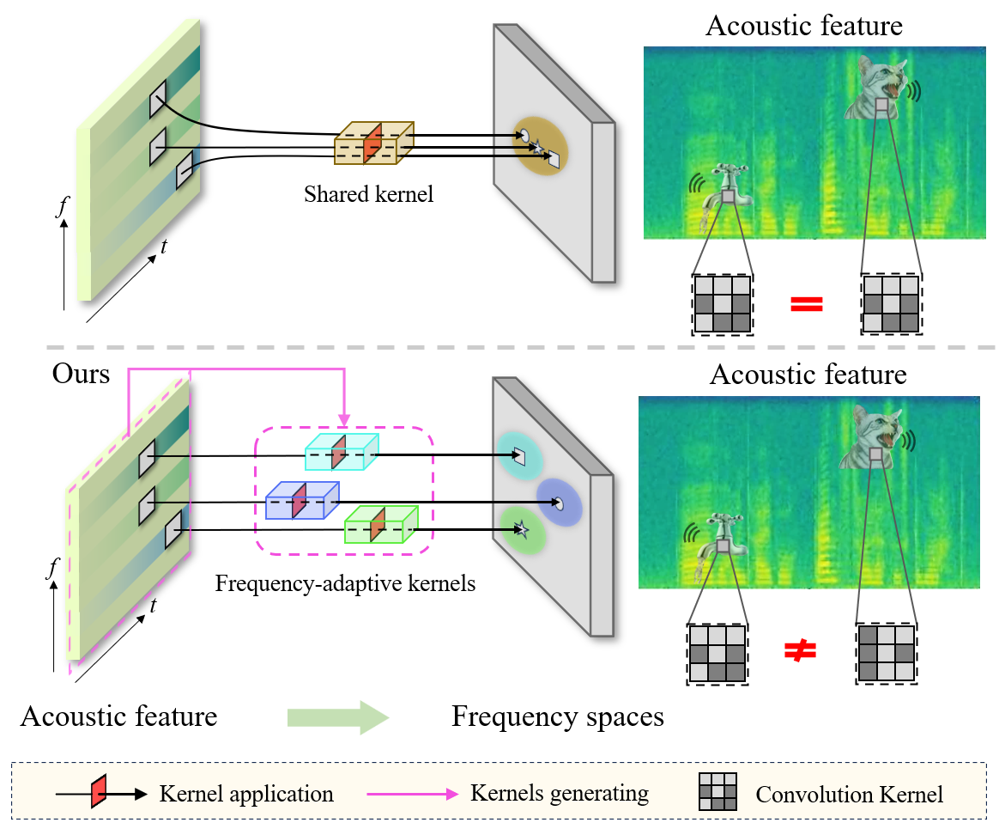
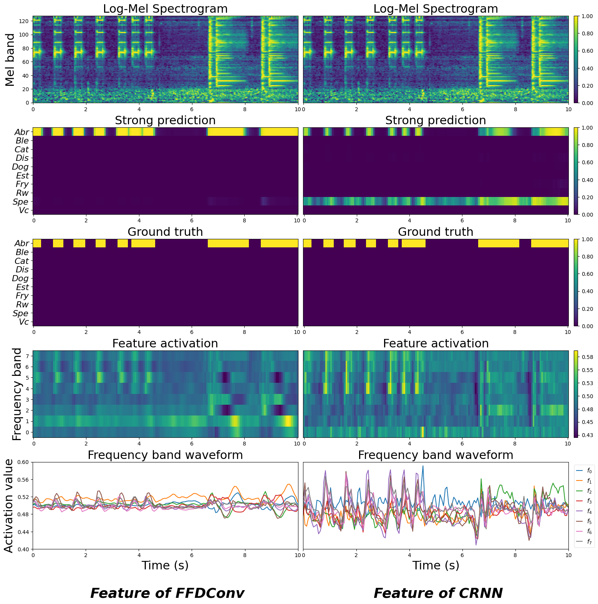

# Full-frequency Dynamic Convolution [](https://arxiv.org/abs/2401.04976)
The official implementation of *Full-frequency dynamic convolution: a physical frequency-dependent convolution for sound event detection.* (Accepted by ICPR 2024)<br>Authors: Haobo Yue, Zhicheng Zhang, Da Mu, Yonghao Dang, Jianqin Yin, Jin Tang

[Issues :blush:](https://github.com/Harper812/FFDConv/issues) **|** [Lab :clap:](https://github.com/BUPT-COST-lab) **|** [Contact :mailbox:](hby@bupt.edu.cn)  

## Updating
Code is available now!

## Introduction
### Frequency-dependent modeling
*Full-frequency dynamic convolution* (FFDConv) is proposed as the first full-dynamic method in SED. It generates frequency kernels for every frequency band, which is designed directly in the structure for frequency-dependent modeling. FFDConv physically furnished 2D convolution with the capability of frequency-dependent modeling.
<div align="center">

</div>

### Fine-grained temporal coherence
Most SED models are trained in a frame-based supervised way, which always leads to the feature and output being discrete over time. FFDConv can alleviate this by frequency-dependent modeling. Besides, the convolution kernel of FFDConv for a frequency band is shared in all frames, which can produce temporally coherent representations. This is consistent with both the continuity of the sound waveform and the vocal continuity of sound events.
<div align="center">

</div>


## Performance
FFDConv is evaluated on [DESED](https://github.com/turpaultn/DESED)

Model                   | Params | PSDS1 $\uparrow$| PSDS2 $\uparrow$| EB-F1 $\uparrow$| IB-F1 $\uparrow$
:----------------------:|:--------------:|:--------------:|:--------------:|:----------------:|:-------------:
CRNN                    | 4M | 0.370          | 0.579          | 0.469            | 0.714
DDFConv                 | 7M | 0.387          | 0.624          | 0.467            | 0.720
FTDConv                 | 7M | 0.395          | 0.651          | 0.495            | <ins>0.740</ins>
SKConv                  | -  | 0.400          | -              | 0.520            | -
FDConv                  | 11M | 0.431          | 0.663          | 0.521            | 0.738
MFDConv                 | 33M | **0.461**      | <ins>0.680</ins>   | **0.542**        | -
FFDConv                 | 11M | <ins>0.436</ins>   | **0.685**      | <ins>0.526</ins>     | **0.751**


## Reference
Our code is implemented based on [FDY-SED](https://github.com/frednam93/FDY-SED) and [ddfnet](https://github.com/theFoxofSky/ddfnet).<br>Specifically, experimental environment is based on [FDY-SED](https://github.com/frednam93/FDY-SED), and model structure is based on [ddfnet](https://github.com/theFoxofSky/ddfnet).<br>Thanks for their great work!


## Citation
If this repository helped your works, please cite papers below! :kissing_heart:
```bib
@article{yue2024fullfrequency,
      title={Full-frequency dynamic convolution: a physical frequency-dependent convolution for sound event detection}, 
      author={Haobo Yue and Zhicheng Zhang and Da Mu and Yonghao Dang and Jianqin Yin and Jin Tang},
      journal={arXiv preprint arXiv:2401.04976},
      year={2024},
}
```
